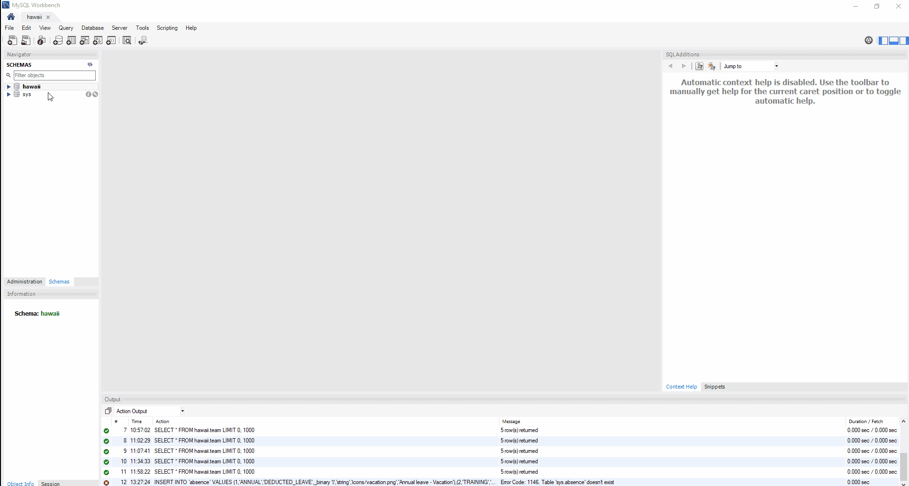
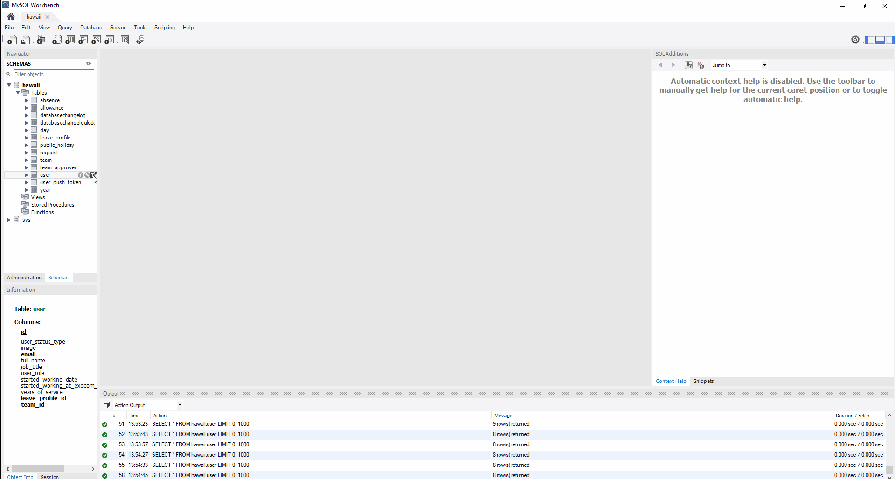

# Hawaii

## Backend

### Getting Started
These instructions will get you a copy of the project up and running on your local machine for development and testing purposes.

#### Prerequisites
What things you need to setup before starting server

- Install [Java 10](https://docs.oracle.com/javase/10/install/overview-jdk-10-and-jre-10-installation.htm) ([Windows](https://drive.google.com/file/d/1EE0cBbfHbFgB-zxBx_nAnORO19HCZCkB/view?usp=sharing)) and set the JAVA_HOME Environment Variable. Java 10 is mandatory because newer versions of Java are not going to work.
- Install [Maven](https://maven.apache.org/install.html)
- Install [MySQL](https://dev.mysql.com/doc/mysql-installation-excerpt/5.7/en/)
- Install [Tomcat 9](https://octopus.com/blog/installing-tomcat-from-scratch)

##### Common
- Install Lombok plugin in IntelliJ
- Install PlantUml plugin in IntelliJ

##### Other

- In order to connect with Google services, the application needs
to be registered in the Google Cloud Platform API console and 
provided with service account credentials. Credentials are stored in a
JSON file that can be obtained from the API console.
To create the credentials file, go to 
```
Google API console > Credentials > Create credentials > 
Service account key > Choose JSON (default) > Create.
```
Save the generated file to the applications `src/main/resources` folder and rename it
to `service_account.json`.

- Create `application.properties` in reference to `application.properties.example`. Setup configurations based on 
your needs.

#### Create MySQL database:
```sh
Database name: hawaii
Port: 3306
Username: root
Password: root
```

#### Building application:

1 . Navigate to <br/>
```
project_root
```

2 . Make a copy of application.properties.example in `src/main/resources named` application.properties and change to mached desired config

3 . Generate war file <br/>

- Generating standard war file
```
mvn clean install 
```

- Generating war file with skip-tests profile enabled (standard war file without tests)
```
mvn clean install -P skip-tests
```

- Generating war file with build-frontend profile enabled (standard war file with frontend build)
```
mvn clean install -P build-frontend
```

4 . Run SQL script which can be found in `src/main/resources` in order to populate database



5 . Add you credentials with **@execom** domain to the user table in order to login into the app




##### Start with maven
```
mvn spring-boot:run
```

Then go to http://localhost:8080 to see results

##### Start with tomcat

1 . Move war file from _target_ folder to tomcat _webapps_ folder

2 . Start tomcat with: <br/>
```
service tomcat start 
```

Or startup.sh from bin folder <br/>
```
./startup.sh
```

Then go to http://localhost:8080/hawaii (*) to see results

(*) _/hawaii_ path depends on tomcat configuration

3 . Stop tomcat with: <br/>
```
./shutdown.sh 
```

## Frontend

### Getting Started

These instructions will get you a copy of the project up and running on your local machine for development and testing purposes.

#### Prerequisites

What things you need to setup before starting server

- Install [Node](https://nodejs.org/en/)
- Install [Yarn](https://yarnpkg.com/lang/en/docs/install/#debian-stable)

#### Server starting

1 . Navigate to <br/>
```
project_root/src/main/frontend
```

2 . Install node_modules <br/>
```
yarn or npm install
```

3 . And start with <br/>
```
yarn start or npm start
```

Then open http://localhost:3000/ to see your app

Install Redux DevTools plugin for your browser

#### Swagger

Always you can check endpoints on url:

```http://localhost:8080/swagger-ui.html```